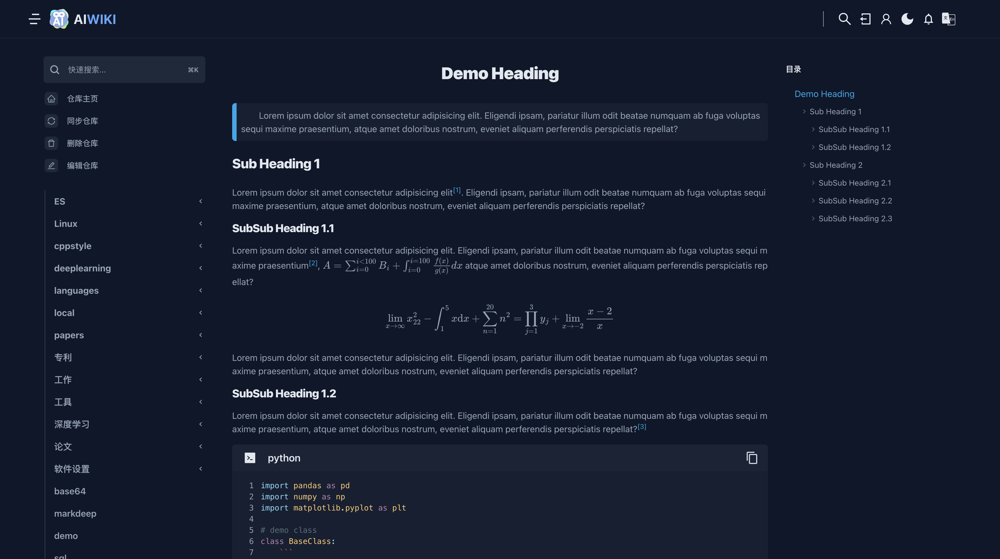
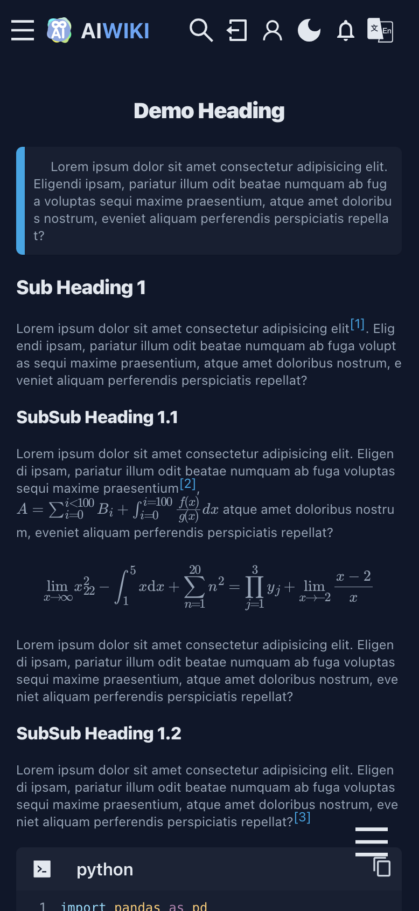

<p align="center">
  <a href="https://www.zizdlp.com" aligin="center" style="flex" >
      
  </a>
</p>

<p align="center">
  A Full-Stack Markdown Repository Documentation Viewer System
</p>

[English](README.md)

------

MDLite: A Full-Stack Markdown Online Viewing System

## 安装

### A.本地测试版

The backend is built using Golang, and the frontend is developed with Next.js. Therefore, the following dependencies are required:

- golang
- nodejs

#### how to install


##### Backend
Dependencies:golang
Modify the path in wiki_backend/app.env
```shell
cd wiki_backend
go mod tidy
make server
```

##### Frontend
Dependencies:nodejs
```shell
cd wiki_frontend
npm install
npm run dev
```


### B.Prod

To install MDLite, you need to first install Docker & Docker Compose. If you wish to use the make command, you also need to install make.

### 2. Parameter Configuration

Modify the volumes section in dev-docker-compose.yaml, where "./src" is the path to the markdown repository, and "./des" is the temporary file path.
```shell
volumes:
  - ./src:/tmp/src
  - ./des:/tmp/des
```


### 3.install

Local Testing: Execute the command：`make run_compose`。

## Visual Effects / Screenshots






