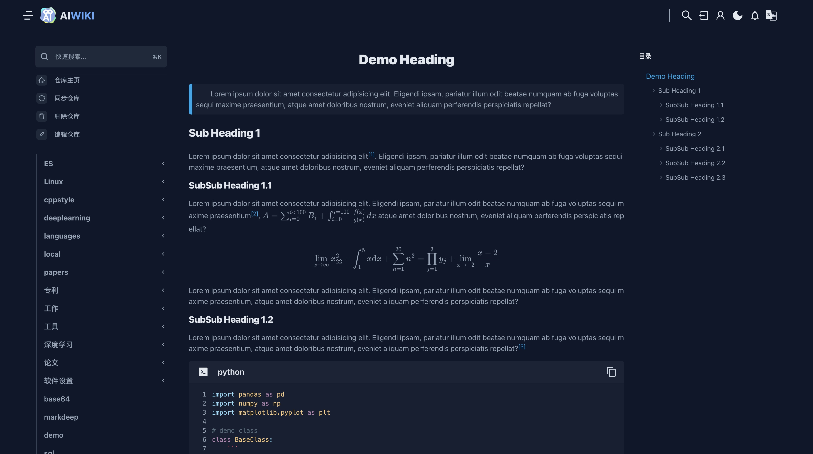
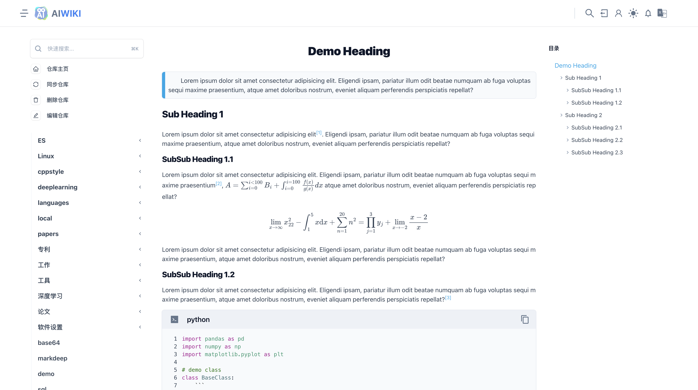
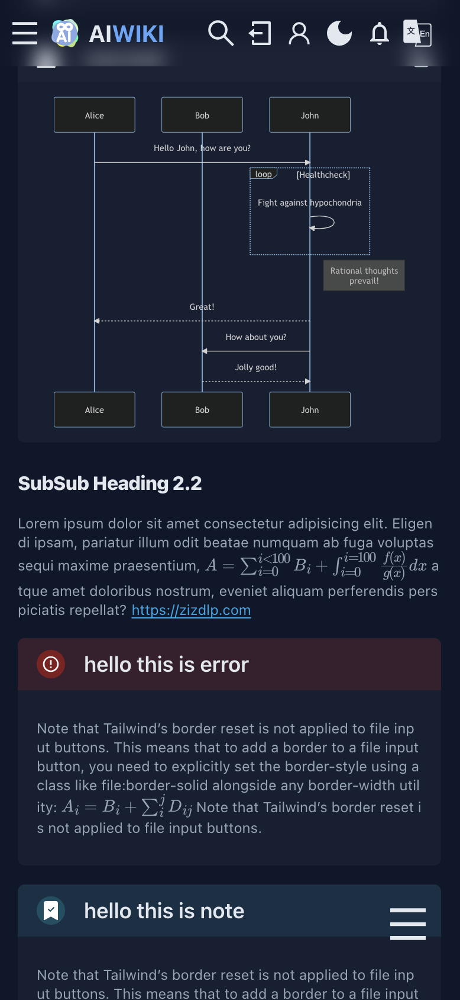
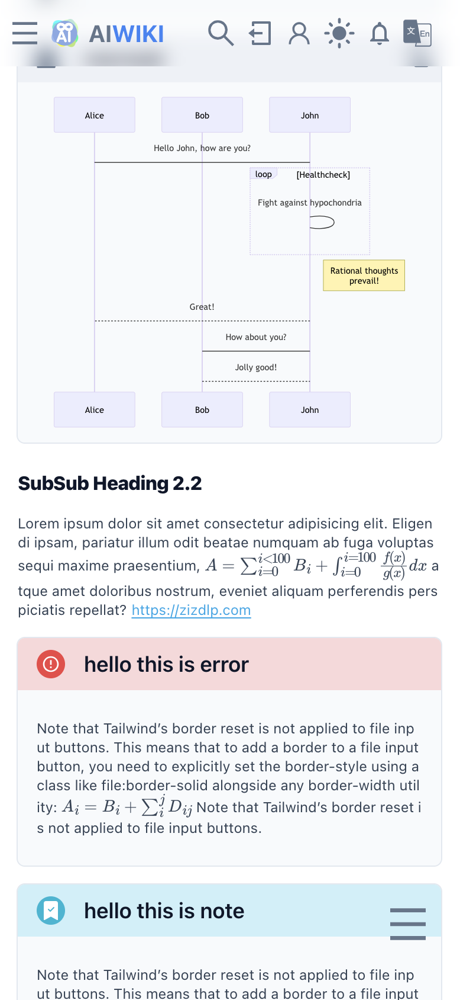
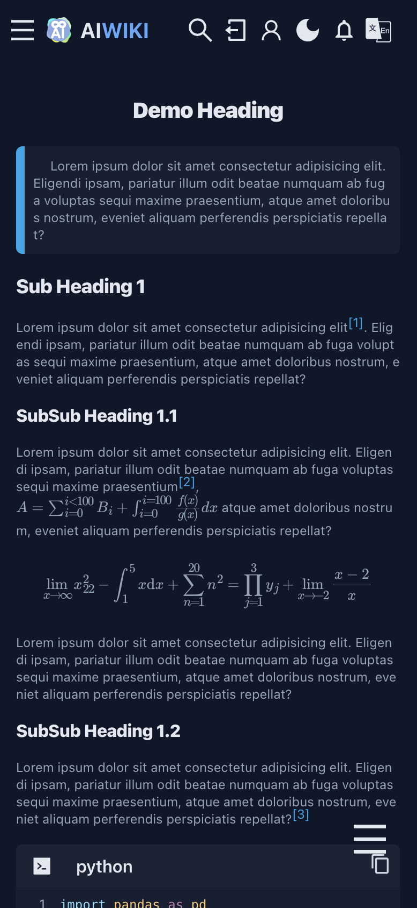
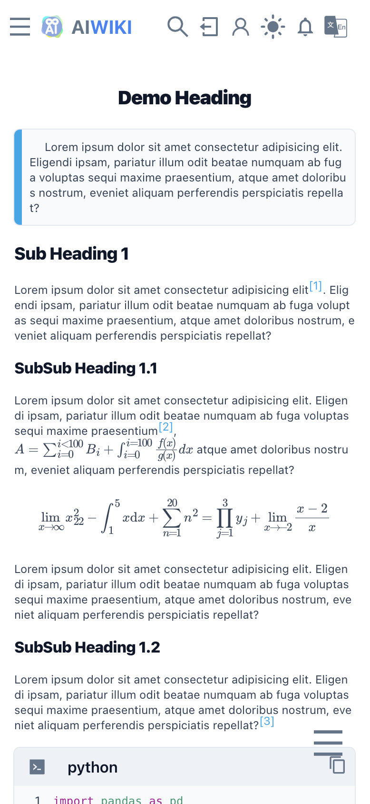

<p align="center">
  <a href="https://www.zizdlp.com" aligin="center" style="flex" >
      
  </a>
</p>

<p align="center">
  一个全栈markdown仓库文档阅览系统
</p>

[English](README.md)

------

MDLite 是一个全栈markdown在线浏览系统。使用MDLite，你可以将一个多目录markdown仓库渲染为优美的网页文档

## 安装

### A.本地测试版

后端使用golang，前端使用nextjs,因此如下依赖是必须的:

- golang
- nodejs

#### 如何安装


##### 后端
依赖：golang
路径修改wiki_backend/app.env
```shell
cd wiki_backend
go mod tidy
make server
```

##### 前端
依赖：nodejs
```shell
cd wiki_frontend
npm install
npm run dev
```


### B.生产测试版

要安装MDLite,你需要首先安装[docker & docker compose](https://docs.docker.com/get-docker/),要想使用make 命令，需要安装make

### 2. 参数配置

修改dev-docker-compose.yaml中valumes，其中"./src" 是markdown仓库路径，"./des"是临时文件路径
```shell
volumes:
  - ./src:/tmp/src
  - ./des:/tmp/des
```


### 3.安装

本地测试：执行命令：`make run_compose`。

## 效果图







