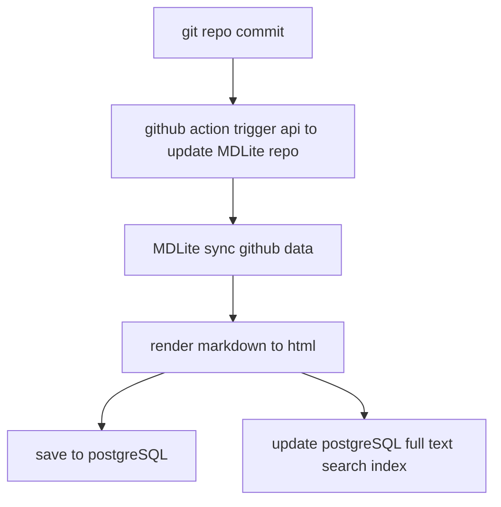

<p align="center">
  <a href="https://www.zizdlp.com" aligin="center" style="flex" >
      
  </a>
</p>

<p align="center">
  一个全栈markdown仓库文档阅览系统
</p>

[English](README.md)

------

MDLite 是一个全栈markdown在线浏览系统。使用MDLite，你可以将一个多目录markdown仓库渲染为优美的网页文档

## 安装

### 1. 前提

  要安装MDLite,你需要首先安装[docker & docker compose](https://docs.docker.com/get-docker/)

### 2. 参数配置

MDLite 需要配置一些参数. 我们提供了两个模版，一个是本地测试，一个用于服务器部署，参见 run 目录下的`prod.env`,`dev.env`

- `NEXT_PUBLIC_BACKEND_URL` = 电脑局域网ip (服务器部署:设为域名+`/backend/`)
- `NEXT_PUBLIC_HOME_URL` = `http://localhost:3000/` (服务器部署:设为域名)
- `NEXT_PUBLIC_SERVER_URL` = 电脑局域网ip (服务器部署:设为域名+`/backend/`)
- `NEXT_PUBLIC_USE_HTTPS`=本地模式设为false(本地使用http),服务器部署设为true，使用https
- `NEXTAUTH_URL` = `http://localhost:3000/` (服务器部署:设为域名)
- `NEXT_PUBLIC_GEO_KEY` = 获取免费的 [api key](https://app.ipgeolocation.io/),(本地模式:不需要这个，保持默认配置即可)

### 3.安装

本地测试：进入run 目录，执行脚本`bash dev_compose.sh`。默认所有的镜像都会重新构建，这个可能需要一些时间。你也可以使用docker hub上的镜像， 取消注释`#image` ,并注释掉`build:` 所属内容。

对于服务器部署,需要额外配置nginx参数，参见 cert 目录,更换两个证书文件，更快nginx.conf中域名信息 `domain name`

### 如何使用

1. 首先你需要注册一个账号，如果用户名是`admin`则这个账户是管理员，拥有额外的权限。
2. 登陆到用户页面，可以点击头像个性签名等进行更换。`Secret Sync Key:`是用于github action的同步密钥，当你在本地的git仓库提交改动后，github action 将会触发MDLite api接口，同步MDLite上面的仓库。下面是一个示例。你可以配置 repo id, username, 以及 `Secret Sync Key(API_KEY)`.

```shell
on: push
jobs:
  deployment:
    runs-on: ubuntu-latest
    steps:
    - name: Deploy Stage
      uses: fjogeleit/http-request-action@v1
      with:
        url: 'https://zizdlp.com/backend/sync_repo'
        method: 'POST'
        customHeaders: '{"Content-Type": "application/json"}'
        data:  '{"repo_id":${{ secrets.API_ID }}, "username":  "${{ secrets.API_USER }}" ,"key": "${{ secrets.API_KEY }}"}'
```

3. 点击新建仓库,填充对应信息,如果git仓库是私有的，用户名、密码任意填写就好, 否则应填写对应信息，否则无法clone你的仓库。出于安全原因，建议使用access token 而不是密码。


4. 你可以修改删除，手动同步仓库。


5. 你可以搜索文档。


6. 点击仓库查看仓库文档。


7. 对于管理员账号`admin`

点击如下图标，进入管理员页面


用户以及会话信息:


在线会话的地理位置


8. 其他特征
  尝试探索MDLite。

### MDLite如何工作的



### 动机

之前使用gitbook挺喜欢的，但是由于在国外，服务经常连不上，现在更难使用了，此外还不能有效导出（免费用户)，后来使用mkdocs，中文检索、私密性都有些问题。自己做希望能达到若干期望:

- 私密：不是博客谁都可以看，所以自然有授权功能（登陆
- 在线同步：本地使用git commit，然后云上自动同步
- 中英文全文检索
- 好看（符合自己的偏好）
- 足够快
